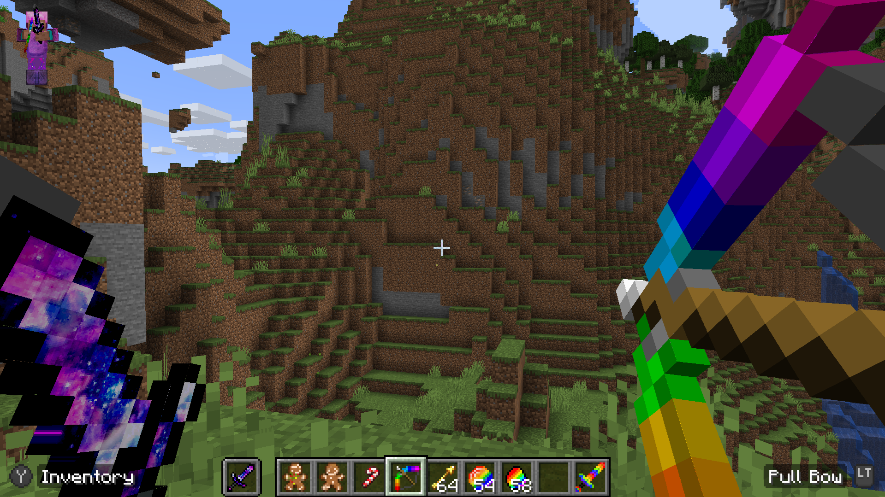
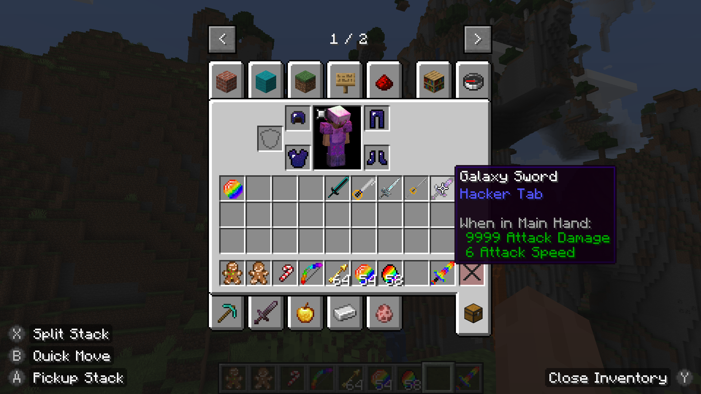
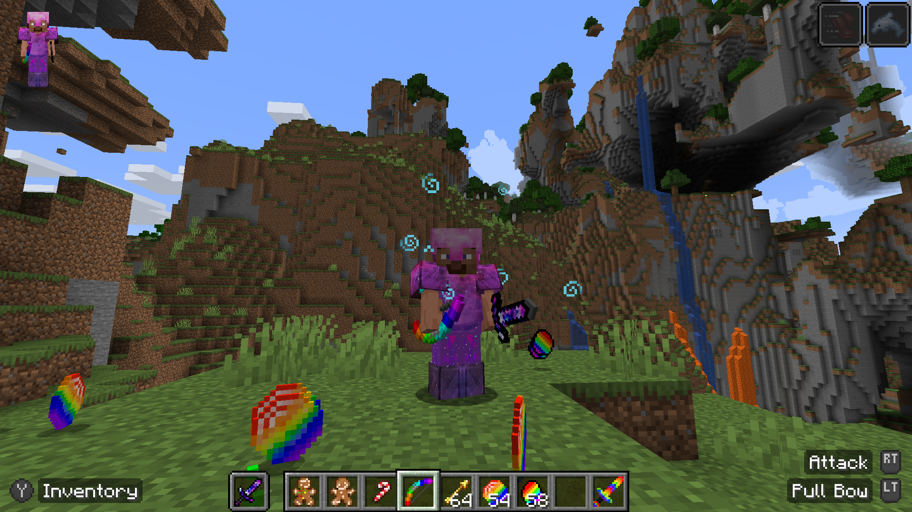
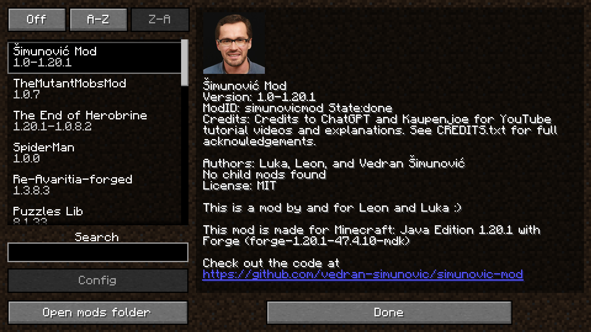

# Šimunović Mod

A Minecraft Forge mod for **Minecraft: Java Edition 1.20.1**, created by **Luka, Leon, and Vedran Šimunović**.

This mod is developed using **Forge 47.4.10 (MDK)** and is intended as both a learning project and a functional mod with custom features.

---

## 📦 Mod Information

- **Mod Name:** Šimunović Mod  
- **Minecraft Version:** 1.20.1  
- **Mod Loader:** Forge (javafml)  
- **Forge Version:** 47.4.10  
- **Authors:** Luka, Leon, and Vedran Šimunović  
- **License:** See `LICENSE` file  
- **Client / Server:** Works on both (unless otherwise specified)

---

## ✨ Features

- Custom items and blocks  
- Custom creative mode tabs  
- Forge-based mod structure  
- Expandable and beginner-friendly codebase  

*(Add or remove features as your mod grows.)*

---

## 🖼️ Screenshots

Below are screenshots showcasing the mod in-game.

### First-Person View


### Creative Mode Tab


### Inventory View


### Third-Person View


### Mods Menu Overview


> 📁 Screenshots are stored in the `/screenshots` folder at the root of the repository.

---

## 🛠️ Development Setup

1. Clone the repository:
   ```bash
   git clone https://github.com/vedran-simunovic/simunovic-mod.git
